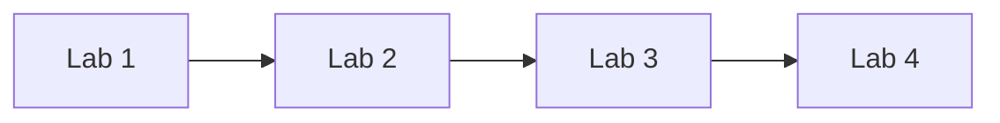
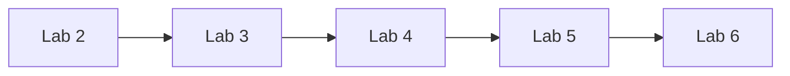
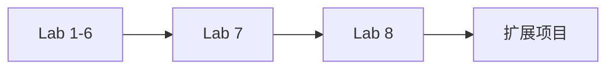

# 🤖 AIOps 智能运维培训课程体系

> 从统计学方法到 LLM 应用，构建完整的 AIOps 技术栈

[](https://opensource.org/licenses/MIT)
[](https://www.python.org/downloads/)
[](#课程目录)

---

## 📖 课程简介

本课程体系专为 **AI 运维工程师**、**SRE**、**数据科学家**设计，涵盖从传统统计学到最新 LLM 应用的完整技术栈。通过 8 个精心设计的动手实验，帮助你系统掌握 AIOps 的核心技能。

### 🎯 适合人群

- ✅ **运维工程师** - 希望用 AI 提升运维效率
- ✅ **SRE** - 构建智能监控和故障诊断系统
- ✅ **数据科学家** - 将 ML/DL 应用于运维场景
- ✅ **技术管理者** - 了解 AIOps 落地实践
- ✅ **学生/研究者** - 学习工业界最佳实践

### 💡 核心特色

1. **循序渐进** - 从基础统计学到深度学习，再到 LLM 应用
2. **实战导向** - 每个实验都有完整的代码和数据集
3. **生产级代码** - 遵循工程最佳实践，可直接用于生产
4. **双模式设计** - 高级功能 + 简化版本，兼顾学习和实用
5. **零门槛** - 大部分实验仅需 Python 标准库

---

## 📚 课程目录

### 模块 1：基础异常检测（Lab 1-3）

| Lab | 名称 | 难度 | 时间 | 核心技术 | 状态 |
|-----|------|------|------|---------|------|
| [Lab 1](./lab1_3sigma_anomaly_detection/) | 3-Sigma 异常检测 | ⭐⭐ | 45min | 统计学 | ✅ |
| [Lab 2](./lab2_isolation_forest/) | Isolation Forest | ⭐⭐⭐ | 75min | 机器学习 | ✅ |
| [Lab 3](./lab3_lstm_autoencoder/) | LSTM Autoencoder | ⭐⭐⭐⭐ | 105min | 深度学习 | ✅ |

**学习目标**: 掌握异常检测的三种范式（统计→ML→DL）

---

### 模块 2：时序预测与边界检测（Lab 4-5）

| Lab | 名称 | 难度 | 时间 | 核心技术 | 状态 |
|-----|------|------|------|---------|------|
| [Lab 4](./lab4_prophet_forecast/) | Prophet 时序预测 | ⭐⭐⭐ | 75min | 时序分解 | ✅ |
| [Lab 5](./lab5_ocsvm_anomaly_detection/) | One-Class SVM | ⭐⭐⭐⭐ | 82min | 边界检测 | 🚧 |

**学习目标**: 理解预测性维护和未知故障识别

---

### 模块 3：LLM 与智能运维（Lab 6-8）

| Lab | 名称 | 难度 | 时间 | 核心技术 | 状态 |
|-----|------|------|------|---------|------|
| [Lab 6](./lab6_rag_knowledge_qa/) | RAG 知识问答 | ⭐⭐⭐⭐⭐ | 135min | 检索增强生成 | ✅ |
| [Lab 7](./lab7_llm_agent_ops/) | LLM Agent 自主运维 | ⭐⭐⭐⭐⭐ | 105min | 智能决策 | ✅ |
| [Lab 8](./lab8_chatops_integration/) | ChatOps 集成 | ⭐⭐⭐⭐ | 105min | IM 机器人 | 🚧 |

**学习目标**: 掌握 LLM 在运维中的三种应用模式

---

## 🚀 快速开始

### 环境要求

- Python 3.10+
- Git（用于克隆仓库）
- 任意文本编辑器（VS Code / PyCharm / Vim）

### 一键体验

```bash
# 克隆项目
git clone https://github.com/aiops-training.git
cd aiops_training/Labs

# 选择任意实验（以 Lab 1 为例）
cd lab1_3sigma_anomaly_detection

# 运行完整流程
make all
```

### 分步执行

```bash
# 1. 准备环境（如需要）
make venv
make deps

# 2. 生成数据
make data

# 3. 运行实验
make run

# 4. 清理（可选）
make clean
```

---

## 📊 学习路径建议

### 入门级（运维新手）



**重点**: 掌握基础的统计和机器学习方法，理解异常检测的核心思想。

**预计时间**: 4-6 小时

---

### 进阶级（有一定经验）



**重点**: 深入学习深度学习和 LLM 应用，构建完整的智能检测能力。

**预计时间**: 8-10 小时

---

### 专家级（追求前沿）



**重点**: 掌握最新的 LLM Agent 技术，能够设计和实现复杂的 AIOps 系统。

**预计时间**: 12-15 小时

---

## 🎓 能力培养目标

完成本课程后，你将能够：

### 技术能力

- ✅ **异常检测** - 使用统计学、ML、DL 方法检测各类异常
- ✅ **时序预测** - 基于历史数据预测未来趋势和异常
- ✅ **根因分析** - 智能定位故障根源，减少 MTTR
- ✅ **智能问答** - 构建基于知识库的智能问答系统
- ✅ **自主决策** - 设计能够自主分析和决策的 AI Agent

### 工程能力

- ✅ **系统设计** - 架构可扩展、可维护的 AIOps 平台
- ✅ **代码质量** - 编写清晰、高效、可测试的代码
- ✅ **文档撰写** - 产出专业的技术文档和实验报告
- ✅ **问题解决** - 独立分析和解决复杂运维问题

---

## 📦 项目结构

```
aiops_training/
├── Labs/                      # 实验目录
│   ├── README_ALL_LABS.md     # 课程体系总览
│   ├── EXPERIMENT_OBJECTIVES.md # 实验目标详细汇总
│   │
│   ├── lab1_3sigma_anomaly_detection/
│   ├── lab2_isolation_forest/
│   ├── lab3_lstm_autoencoder/
│   ├── lab4_prophet_forecast/
│   ├── lab5_ocsvm_anomaly_detection/  (Coming Soon)
│   ├── lab6_rag_knowledge_qa/
│   ├── lab7_llm_agent_ops/
│   └── lab8_chatops_integration/      (Coming Soon)
│
├── README.md                  # 项目总览（本文件）
├── traning_plan.md            # 培训方案详细计划
└── docs/                      # 补充文档
    ├── installation_guide.md  # 安装指南
    ├── faq.md                 # 常见问题
    └── contributing.md        # 贡献指南
```

---

## 🛠️ 技术栈总览

### 编程语言
- **Python 3.10+** - 主要开发语言

### 核心库
- **NumPy/Pandas** - 数据处理和分析
- **Matplotlib/Seaborn** - 数据可视化
- **scikit-learn** - 机器学习算法

### 深度学习
- **PyTorch** - 深度学习框架
- **torch.nn** - 神经网络模块

### 时序分析
- **Prophet** - 时序预测模型
- **statsmodels** - 统计模型

### LLM 相关
- **sentence-transformers** - 文本嵌入
- **FAISS** - 向量相似度搜索
- **LangChain** - LLM 应用框架（可选）

### 工具链
- **Make** - 自动化脚本
- **uv** - Python 包管理（可选）
- **Git** - 版本控制

---

## 📝 评估方式

### 实验完成度（60%）

- 成功运行所有必做实验
- 生成正确的输出结果
- 代码无语法错误

### 实验报告（30%）

- 理解实验原理
- 分析实验结果
- 提出改进建议

### 扩展项目（10%）

- 添加新功能
- 优化现有代码
- 分享学习心得

---

## 🏆 成就系统

完成不同阶段的学习，解锁成就徽章：

| 成就 | 条件 | 徽章 |
|------|------|------|
| 入门学者 | 完成 Lab 1-3 | 🥉 |
| 进阶达人 | 完成 Lab 1-6 | 🥈 |
| 专家团队 | 完成 Lab 1-8 | 🥇 |
| 创新先锋 | 贡献扩展项目 | 🌟 |

---

## 👥 学习社区

### 加入讨论

- **GitHub Discussions** - 提问和分享
- **Issue Tracker** - 报告问题和改进建议
- **Weekly Meetup** - 线上技术交流会

### 学习小组

组建或加入学习小组，共同进步：
- 3-5 人一组
- 每周一次代码 review
- 分享学习笔记

---

## 📞 支持与反馈

### 遇到问题？

1. **查看 FAQ** - 大部分常见问题已有解答
2. **搜索 Issue** - 可能已有其他人遇到过
3. **提交 Issue** - 详细描述你的问题
4. **社区求助** - 在 Discussion 中提问

### 联系方式

- **项目主页**: [GitHub Repository](https://github.com/aiops-training)
- **问题反馈**: [Issue Tracker](https://github.com/aiops-training/issues)
- **讨论区**: [Discussions](https://github.com/aiops-training/discussions)

---

## 🤝 贡献指南

我们欢迎各种形式的贡献：

### 可以贡献什么？

- ✅ 修复 bug
- ✅ 改进文档
- ✅ 添加新的实验案例
- ✅ 优化现有代码
- ✅ 分享学习心得
- ✅ 翻译其他语言版本

### 如何开始？

1. Fork 本项目
2. 创建特性分支 (`git checkout -b feature/AmazingFeature`)
3. 提交更改 (`git commit -m 'Add some AmazingFeature'`)
4. 推送到分支 (`git push origin feature/AmazingFeature`)
5. 开启 Pull Request

详见 [CONTRIBUTING.md](docs/contributing.md)

---

## 📄 许可证

MIT License - 详见 [LICENSE](LICENSE) 文件

---

## 🙏 致谢

感谢所有为 AIOps 社区做出贡献的开发者！

特别感谢：
- [Facebook Prophet](https://facebook.github.io/prophet/) 团队
- [scikit-learn](https://scikit-learn.org/) 团队
- [Hugging Face](https://huggingface.co/) 团队
- [LangChain](https://langchain.com/) 团队

---

## 📈 项目统计


---

## 🔗 相关链接

### 学习资源

- [AIOps 白皮书](https://example.com/aiops-whitepaper)
- [机器学习运维实践](https://example.com/mlops-guide)
- [智能运维案例集](https://example.com/aiops-cases)

### 行业报告

- Gartner: 《2026 年 AIOps 采用率将超过 60%》
- Forrester: 《LLM 如何变革 IT 运维》
- IDA: 《中国 AIOps 市场分析报告 2026》

### 开源项目

- [OpenTelemetry](https://opentelemetry.io/) - 可观测性框架
- [Prometheus](https://prometheus.io/) - 监控系统标准
- [Grafana](https://grafana.com/) - 可视化平台

---

**Happy Coding! 🚀**

---

*最后更新*: 2026-03-19  
*维护者*: AIOps Training Team  
*版本*: v1.0.0
